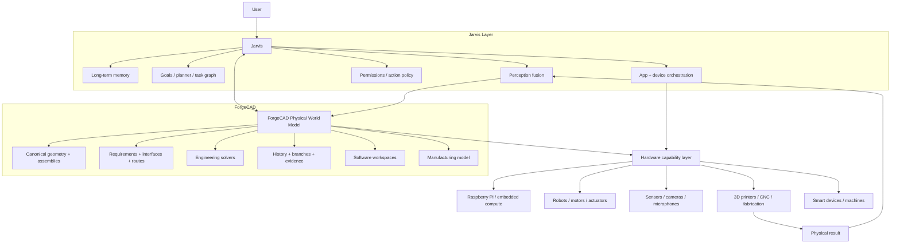

# ForgeCAD

> **An AI-native, local-first engineering environment for designing, simulating, coding, manufacturing, testing, and eventually operating real physical systems.**

ForgeCAD is the physical-engineering substrate for the broader Jarvis project.

Today, ForgeCAD is a desktop engineering workstation that combines CAD, real-world component selection, embedded software, deterministic engineering analysis, Git-like design lineage, manufacturing preparation, physical test evidence, and autonomous design exploration in one application.

The long-term goal is larger: ForgeCAD should become **Jarvis's canonical model of physical reality** — the system Jarvis uses to understand what physical things are, how they are built, where they are, what they can do, how they are connected, how they are behaving, and how they can be safely changed.

The intended end state is not "an AI chatbot attached to CAD." It is a system in which a user can describe a physical objective and Jarvis can reason from intent through architecture, component selection, CAD, electronics, software, simulation, fabrication, testing, deployment, observation, and revision while preserving explicit engineering state, provenance, permissions, and evidence at every step.

---

## Status

**Current release line:** ForgeCAD 2.0.0  
**Primary development branch:** `forgecad/full-v110-scope`

ForgeCAD 2.0 is already a functioning local engineering system, not a future design document. The project currently includes:

- a packaged Electron desktop application for Windows and macOS;
- a local Python engineering service built on FastAPI, CadQuery/OpenCascade, NumPy, and SciPy;
- exact/custom CAD plus real purchased-component geometry;
- a component registry containing more than 1,400 engineering components;
- deterministic project operations and canonical design state;
- Git-like physical design branches and engineering history;
- attached code workspaces for programmable hardware;
- structural, rigid-body, tolerance, electrical, thermal, fluid, routing, kinematic, and safety analysis layers;
- manufacturing preparation and 3MF export;
- real-world verification evidence tied to exact design fingerprints;
- autonomous multi-branch engineering campaigns;
- a `.focad` portable project format;
- a local-model engineering copilot;
- an API surface designed to be callable by Jarvis.

ForgeCAD deliberately distinguishes **implemented engineering capability** from **planned capability**. Everything under [Current system](#current-system-forgecad-20) describes the current 2.0 codebase. Everything under [Long-term architecture](#long-term-architecture-forgecad--jarvis) and [Roadmap](#roadmap) describes the intended direction unless explicitly marked otherwise.

---

# Why ForgeCAD exists

Most engineering software divides a physical product across disconnected tools:

- CAD knows geometry but not embedded code;
- an IDE knows code but not the mechanical assembly containing the computer;
- electrical tools know nets but not necessarily the physical cable route;
- simulation tools know a load case but not whether the prototype actually worked;
- Git knows files but not whether revision 17 was physically verified;
- AI systems can suggest ideas but usually do not own deterministic engineering state;
- home automation and robotics systems can actuate devices but generally do not understand their engineering construction.

ForgeCAD treats the **physical system itself** as the primary object.

A motor is not just a mesh. It has mass, geometry, interfaces, voltage, current limits, mounting constraints, procurement identity, thermal properties, provenance, and potentially software-controlled behavior. A Raspberry Pi is not only a component card; it can own a code workspace inside the same design branch. A printed bracket is not finished when an STL exists; it can be manufactured, tested, photographed, measured, marked working or failed, and compared against the exact design that produced it.

The core premise is:

> **Geometry, components, code, requirements, simulations, manufacturing, physical evidence, and design history should all describe the same canonical physical object.**

That is what makes ForgeCAD useful on its own and what makes it strategically important to Jarvis.

---

# Product thesis

ForgeCAD should feel closer to working with a real object than editing disconnected engineering files.

The basic loop is:

1. **Describe an objective.**
2. **Turn intent into explicit requirements and functional architecture.**
3. **Select trusted real components or design custom parts.**
4. **Build the physical assembly, electronics, routes, joints, code, and constraints.**
5. **Run deterministic engineering checks.**
6. **Branch alternatives instead of destroying a known-good design.**
7. **Manufacture or assemble the design.**
8. **Attach real-world results to the exact revision tested.**
9. **Compare working and non-working variants.**
10. **Iterate using both simulation and physical evidence.**

AI participates throughout this loop, but AI-generated reasoning is not allowed to silently replace canonical state, solver output, physical evidence, or human verification.

---

# Design principles

## 1. Physical truth over plausible text

If a dimension, voltage, material property, supplier specification, or interface is unknown, it stays unknown until it is resolved from a trusted source or explicitly supplied. ForgeCAD should fail a hard requirement before inventing a value that merely sounds reasonable.

## 2. AI plans; deterministic systems own state

The engineering agent can propose and execute typed operations. Canonical state changes happen through deterministic project commands with validation, history, and rollback semantics.

## 3. Real components are first-class objects

Purchased parts retain immutable identity, provenance, specifications, and trusted geometry. A Raspberry Pi, Mean Well supply, motor, bearing, fastener, sensor, solenoid, or connector should represent a real purchasable object rather than an unnamed primitive box.

## 4. Hardware and software branch together

Software attached to programmable components belongs to the same design lineage as the mechanical and electrical system. Changing firmware can create a materially different physical design even if the CAD is unchanged.

## 5. Known-good physical designs are protected

A branch verified to work in the real world should not be casually overwritten by either a user or an agent. Experimental work branches from that baseline.

## 6. Simulation is evidence, not certification

ForgeCAD uses deterministic engineering analyses to screen, compare, reject, and guide designs. It does not claim that an approximate solver result is equivalent to laboratory verification, regulatory approval, or domain-specific professional certification.

## 7. The real world closes the loop

A design tool becomes much more useful when it remembers which physical prototypes worked, what failed, what measurements were observed, and exactly which revision produced those results.

## 8. Local first

Engineering data, project history, code, model context, and local inference remain on the user's machine by default. External systems should be explicit integrations, not hidden dependencies.

---

# Current system: ForgeCAD 2.0

## Desktop engineering workstation

The desktop client is built with **Electron, React, and TypeScript**. Electron is intentional: ForgeCAD depends on a controlled Chromium target for WebGL2, Three.js, Monaco, ES modules, workers, and complex desktop rendering on both Windows and macOS.

The application is organized around:

- an engineering-copilot rail;
- a central 3D physical workspace;
- engineering/component/analysis context;
- visible design lineage;
- code, history, simulation, and system workspaces;
- project-level manufacturing and evidence flows.

Startup is explicitly staged: ForgeCAD does not treat the UI as ready merely because the local engine has opened a port. The desktop waits for both the engineering runtime and the component catalog/renderer state before unlocking the engineering interface.

## 3D physical workspace

ForgeCAD can manipulate exact custom CAD and purchased-component geometry in a shared scene.

Current interaction includes:

- selection;
- orbit, pan, and zoom;
- move and rotate;
- isolate/hide/show;
- fit and standard views;
- exploded presentation;
- multi-part assembly rendering;
- canonical scene snapshots;
- component-specific metadata and context.

Exploded view and other presentation transforms are intentionally separated from authoritative engineering transforms.

## Real component registry

ForgeCAD ships with a component registry of **1,400+ entries** spanning mechanical, electrical, compute, actuation, sensing, power, routing, and related engineering categories.

A component record can carry:

- manufacturer;
- model / part number;
- category and semantic role;
- trusted or derived geometry;
- geometry fidelity;
- dimensions and envelope;
- mass / center-of-gravity data where known;
- mechanical interfaces;
- electrical interfaces;
- voltage/current/logic properties;
- thermal properties;
- supplier and procurement metadata;
- datasheets and provenance;
- programmable target metadata;
- confidence and field-level source information.

Manufacturer geometry is preferred when available. Derived or proxy geometry must remain distinguishable from manufacturer-verified geometry.

## Canonical project state

ForgeCAD stores engineering information as canonical project data rather than scattering it across UI state.

Current canonical domains include, among other things:

- objects and assemblies;
- parameters;
- requirements;
- loads and constraints;
- joints;
- electrical connections and named nets;
- routes;
- fluid relationships;
- code workspaces;
- manufacturing intent;
- failure modes;
- physical evidence;
- design branches and history.

This is important for Jarvis integration: an external agent does not need to infer the project from screenshots. It can work against structured engineering state and typed operations.

## Parametric and deterministic CAD operations

ForgeCAD uses CadQuery/OpenCascade for canonical geometry. Engineering changes are intended to be represented as typed, auditable operations rather than arbitrary mesh edits.

The engineering agent can modify project state through deterministic operations covering areas such as:

- CAD/geometry;
- parameters;
- components;
- electrical connections;
- routes;
- joints;
- loads and constraints;
- requirements;
- safety records;
- code;
- analyses;
- manufacturing state.

Undo/redo and branch history operate on project operations, not merely DOM state.

## Git-like physical design lineage

ForgeCAD treats experimental hardware iterations more like software branches.

A design can be branched before trying a risky change. Branches can be marked:

- **Working**;
- **Not working**;
- **Unverified**;
- physically verified / known-good where appropriate.

Engineering diffs can compare canonical state between designs, including routes and safety/failure-mode state.

The purpose is not to claim that a diff proves causality. The purpose is to make the differences between a known-working design and a failed experiment explicit enough for a user, solver, or agent to investigate them.

## Programmable-component code workspaces

Programmable hardware can own code directly inside the physical project.

A Raspberry Pi or similar device can expose an attached code workspace without leaving ForgeCAD. The intended model is that firmware/application code is part of the physical design revision, not an unrelated external artifact.

The code environment supports an IDE-style workflow and allows the engineering agent to inspect or modify code alongside the hardware that executes it.

## `.focad` portable project format

ForgeCAD projects can be exchanged as `.focad` packages.

The format is designed to preserve a reproducible engineering workspace including canonical project state, component snapshots, code, branches, and local project assets rather than exporting only geometry.

## Local engineering copilot

ForgeCAD supports local model inference, currently centered on Ollama-hosted models.

Model choice is a host profile rather than a hidden global assumption. A configured model must be reported honestly. ForgeCAD should not silently substitute another model when the requested model is missing.

The engineering agent is intended to reason through this pipeline:

```text
goal
  ↓
requirements
  ↓
functional architecture
  ↓
capability resolution
  ↓
implementation plan
  ↓
typed CAD / electrical / software / manufacturing operations
  ↓
deterministic validation
  ↓
repair / alternative generation
  ↓
verification
```

The agent is allowed to reason broadly. It is not allowed to declare engineering success merely because tool execution returned without an exception.

---

# Current engineering analysis

ForgeCAD 2.0 intentionally combines several engineering domains in one project. These analyses are useful for screening and iteration, but their scope is explicit.

| Domain | Current 2.0 capability | Important limitation |
|---|---|---|
| Structural | Solid FEA screening, project load cases, parameterized structural analysis | Not a replacement for specialized validated FEA workflows in every discipline |
| Modal / rigid body | Modal and rigid-body analysis support | Not a general high-fidelity multibody dynamics suite |
| Tolerances | Deterministic tolerance-stack analysis | Depends on explicitly modeled dimensions/tolerances |
| Electrical | Canonical named nets, interface compatibility, voltage/current/logic validation, conflicting-source detection, current budgets | Not a complete PCB/EMI/power-integrity toolchain |
| Thermal | Steady-state lumped multi-body thermal network, heat loads, conductance, convection, sinks, temperature limits, energy balance | Not CFD; not transient conjugate heat transfer |
| Fluid | Steady-state incompressible network analysis, explicit resistance or Hagen–Poiseuille behavior, pressure/flow limits, Reynolds information | Not general CFD, compressible flow, or a complete pneumatic simulator |
| Routing | Cable/wire/tube/hose/conduit paths, length, bend radius, clearance and conservative obstacle checks | Current obstacle model is intentionally conservative and not a full routing optimizer |
| Route-coupled fluid | Canonical tube route length can drive hydraulic resistance | Accuracy depends on the fluid model assumptions and supplied properties |
| Kinematics | Revolute/prismatic joints, deterministic poses, sampled sweeps, collision/interference screening | Currently sampled rigid single-joint motion rather than continuous general multibody dynamics |
| Safety / FMEA | Canonical failure modes, severity/occurrence/detection, controls, verification state, design-fingerprint evidence | Does not constitute regulatory certification or professional safety approval |

A core rule is that deterministic analysis evidence remains separate from model-generated narrative.

---

# Electrical model

Electrical connectivity is canonical engineering data, not just lines drawn on a schematic.

ForgeCAD supports:

- named electrical nets;
- connection/interface metadata;
- schematic graph representation;
- voltage compatibility checks;
- current-budget checks;
- logic/interface compatibility;
- conflicting power-source detection;
- interface coverage validation;
- deterministic electrical contracts exposed to the planner.

Undo/history preserves net identity and metadata.

---

# Thermal model

The 2.0 thermal system solves a steady-state lumped network.

It can model:

- heat loads;
- thermal conductance;
- convection;
- explicit heat sinks/boundaries;
- temperature limits;
- energy balance.

The solver fails closed on unsupported floating/singular configurations rather than manufacturing a plausible temperature.

It is deliberately labeled as a lumped thermal network, **not CFD**.

---

# Fluid model

ForgeCAD includes a steady-state incompressible hydraulic-network layer.

It supports:

- pressure boundaries;
- flow relationships;
- explicit resistance;
- Hagen–Poiseuille-derived resistance where applicable;
- fluid operating limits;
- Reynolds-number information;
- route-length coupling.

A routed tube can therefore have one canonical physical length that influences both geometry/routing and hydraulic behavior instead of maintaining contradictory duplicate values.

---

# Routing

Routes are first-class physical entities.

Supported route types include:

- cable;
- wire;
- tube;
- hose;
- conduit.

Routes can contain:

- 3D points;
- outer diameter;
- minimum bend radius;
- clearance requirements;
- exact polyline length;
- electrical net / fluid / object bindings;
- conservative collision/obstacle information.

This creates the basis for eventually allowing Jarvis to reason about not only whether two components are logically connected but whether the physical connection can actually be installed.

---

# Safety and failure modes

Failure modes are canonical project state.

ForgeCAD can record:

- severity;
- occurrence;
- detection;
- controls;
- verification requirements;
- optional RPN where explicitly defined;
- current-design verification evidence.

High-severity hazards are deliberately gated. The engineering agent cannot simply assert that its own design is safe and self-verify it. Evidence is tied to the exact design fingerprint so that changing the design can invalidate stale verification.

---

# Mechanism kinematics

ForgeCAD 2.0 can represent revolute and prismatic joints and evaluate sampled motion across defined limits.

The current implementation supports:

- deterministic poses;
- sampled joint sweeps;
- exact B-rep intersection checks at samples;
- joint limits;
- swept bounds;
- interference screening.

The current solver is intentionally narrower than a general-purpose continuous multibody dynamics environment. Expanding this layer is part of the roadmap.

---

# Autonomous engineering campaigns

ForgeCAD can launch autonomous multi-branch engineering campaigns against explicit deterministic requirements.

The intended campaign behavior is:

1. preserve the known-good baseline;
2. create experimental branches;
3. vary parameters, components, code, geometry, or manufacturing choices;
4. run relevant analyses;
5. reject variants that violate requirements;
6. retain evidence and branch history;
7. compare feasible candidates;
8. surface the strongest candidates to the user.

This is an early version of the larger closed-loop engineering architecture described later in this README.

---

# Manufacturing and physical evidence

Manufacturing is not treated as a final "Export STL" button.

ForgeCAD 2.0 includes manufacturing preparation such as:

- fabricated-vs-purchased identity;
- Bambu Lab P2S build-volume fit checks;
- orientation/packing checks;
- 3MF export;
- branch-safe oversized-part splitting;
- package fingerprints;
- manufacturing/test evidence records.

Physical evidence can be attached to an exact design/package fingerprint. If a later edit changes the design, prior evidence becomes stale rather than silently proving a different object.

The longer-term goal is a closed manufacturing loop in which Jarvis can send jobs to fabrication equipment, observe the result, compare it to CAD, diagnose discrepancies, and create a corrective branch.

---

# Jarvis integration today

ForgeCAD exposes its engineering state and operations through a local API so Jarvis can treat it as an engineering capability rather than drive it through fragile mouse/keyboard automation.

The intended division of responsibility is:

### Jarvis

- natural-language interaction;
- cross-application orchestration;
- long-lived goals;
- memory;
- scheduling and monitoring;
- perception;
- device orchestration;
- user permissions and confirmations;
- deciding when physical engineering is required.

### ForgeCAD

- canonical physical design state;
- geometry;
- components and interfaces;
- engineering calculations;
- simulation contracts;
- manufacturing state;
- physical evidence;
- branch lineage;
- deterministic engineering operations;
- physical-system reasoning context.

Jarvis should not reduce a nuanced engineering request to a shallow prompt before passing it into ForgeCAD. The engineering model should receive the original objective plus relevant structured design context.

---

# Long-term architecture: ForgeCAD + Jarvis

The eventual product should no longer feel like two separate applications.

ForgeCAD should become the **physical world model and engineering reasoning engine underneath Jarvis**. Jarvis becomes the cognition, memory, perception, orchestration, and interaction layer around that model.

The target architecture is approximately:



The critical idea is that **perception, engineering, and action update the same physical model**.

---

# The Universal Physical World Model

This is the most important long-term expansion of ForgeCAD.

Today the primary unit is a project. The future model should represent the user's physical environment as a persistent graph such as:

```text
World
└── Site
    └── Building
        └── Room / workspace
            ├── Machine
            │   ├── Assembly
            │   │   ├── Component
            │   │   ├── Joint
            │   │   ├── Route
            │   │   └── Sensor
            │   ├── Software
            │   └── Live state
            ├── Tool
            ├── Material / inventory
            └── Other physical object
```

A physical node should eventually be able to carry:

- identity;
- geometry;
- pose / location;
- uncertainty;
- material;
- mass properties;
- interfaces;
- electrical connectivity;
- fluid connectivity;
- thermal state;
- code/firmware;
- telemetry;
- capabilities;
- ownership / permission policy;
- maintenance state;
- procurement identity;
- design ancestry;
- physical verification evidence;
- known failure modes;
- observed history.

That would allow Jarvis to reason about real objects rather than isolated images or one-off device APIs.

---

# Perception: turning reality into engineering state

Future Jarvis perception should not stop at "a vision model saw a drill."

The goal is a continuously updated physical-state pipeline using, where appropriate:

- cameras;
- microphones;
- depth sensors;
- SLAM / spatial mapping;
- object detection and segmentation;
- 6-DoF pose estimation;
- OCR;
- acoustic-event detection;
- embedded telemetry;
- environmental sensors;
- machine/device APIs;
- measurement tools;
- user-confirmed observations.

Perception results should update the world model with confidence and provenance.

The target distinction is:

```text
Weak representation:
"There is probably a motor in this image."

Target representation:
object: actuator.axis_2.motor
identity: Teknic CPM-SDSK-2310S-RLN
pose: [x, y, z, rx, ry, rz]
confidence: 0.94
controller: cabinet.motion_controller.axis_2
live_temperature: 51.2 C
current_draw: 2.7 A
CAD_design: robot_arm/rev_43
last_service: ...
```

This is what makes diagnosis, simulation, maintenance, and autonomous physical action substantially more reliable.

---

# Universal hardware capability layer

Jarvis should ultimately control hardware through **capabilities**, not piles of one-off scripts.

A device may expose operations such as:

```text
motion.rotate
motion.translate
motion.home
sensor.temperature
sensor.position
sensor.camera
sensor.force
actuator.relay
actuator.pwm
compute.execute
display.render
fabrication.print
fabrication.machine
```

The underlying implementation might be:

- Raspberry Pi;
- ESP32;
- Arduino-class controller;
- robot arm;
- motor controller;
- smart-home device;
- vehicle interface;
- 3D printer;
- CNC machine;
- custom ForgeCAD-built hardware.

Jarvis should reason about what a system **can do** while ForgeCAD preserves how that capability is physically implemented.

---

# Closed-loop autonomous engineering

The major long-term benchmark is a full engineering loop:

```text
intent
  ↓
requirements
  ↓
system architecture
  ↓
component selection / custom part design
  ↓
CAD + electronics + routes + software
  ↓
simulation + safety analysis
  ↓
procurement / manufacturing plan
  ↓
fabrication / assembly
  ↓
calibration / testing
  ↓
perception of real result
  ↓
comparison against expected behavior
  ↓
root-cause analysis
  ↓
new design branch
  ↺
```

A future request such as:

> "Build a desk-mounted robot that can retrieve a drink from the mini-fridge."

should eventually cause the system to determine requirements such as reach, payload, collision envelope, mounting constraints, available power, acceptable noise, safety interlocks, and workspace geometry; choose real motors, drives, bearings, sensors, fasteners, power components, and compute hardware; generate custom mechanical parts; create routes and wiring; write control software; simulate motion and loading; prepare manufacturing output; request purchase/fabrication approval; calibrate the assembled system; test it; and create a corrective revision when observations do not match the model.

That is a much more useful definition of "lore-accurate Jarvis" than merely reproducing a cinematic voice or holographic visual style.

---

# Predict before acting

A mature Jarvis/ForgeCAD system should use the world model to predict likely consequences before physical action.

Examples:

- Will this robot trajectory collide with the fixture?
- Can this power supply handle the new actuator load?
- Will this cable route violate bend radius?
- Does the enclosure exceed the printer build volume?
- Will the modified linkage exceed its joint limit?
- Is the estimated component temperature above its rated operating range?
- Does this revision invalidate a prior physical verification?
- Is the requested action reversible?

The simulation layer will never make reality perfectly predictable, but it can materially reduce avoidable failures and give Jarvis a disciplined alternative to blind trial and error.

---

# Fabrication and self-correction

The manufacturing roadmap extends beyond generating files.

The desired loop is:

1. ForgeCAD determines which objects are purchased and which are fabricated.
2. It selects an appropriate process/resource.
3. Jarvis requests user authorization where required.
4. A fabrication job is sent to the machine.
5. Cameras/sensors observe the job and completed part.
6. The physical part is registered against canonical CAD.
7. Measurements / visual inspection / test results become evidence.
8. Deviations are localized geometrically.
9. ForgeCAD creates a corrective design branch.
10. The cycle repeats until requirements are met or the system reaches a decision boundary requiring the user.

Potential resources include:

- FDM/resin 3D printers;
- CNC equipment;
- laser cutters;
- PCB services;
- test instruments;
- robot assembly cells;
- manually executed workshop steps recorded through guided procedures.

---

# Spatial interface

The long-term UI should be device-independent.

The same canonical physical model should be viewable through:

- the ForgeCAD desktop application;
- iPad/tablet interfaces;
- Jarvis voice interaction;
- AR glasses;
- room displays;
- remote browser clients where appropriate.

The target interaction is semantic rather than menu-driven.

Examples:

> "Jarvis, explode the wrist assembly."

> "Show me the thermal bottleneck."

> "Highlight everything that changed since the last working prototype."

> "Replace that motor with the lightest compatible option that gives me thirty percent more torque."

> "Show me where the failed bracket differs from CAD."

The display should then manipulate or annotate the same authoritative world state rather than construct a temporary visualization disconnected from the engineering model.

---

# Persistent autonomy

A lore-inspired system needs to maintain objectives rather than wait for every instruction synchronously.

Future Jarvis + ForgeCAD should be able to own bounded goals such as:

- keep a machine operational;
- watch a prototype for overheating;
- continue searching a constrained design space;
- detect when a physical system deviates from its expected model;
- prepare a corrective design but wait for approval before fabrication;
- monitor a long-running test;
- maintain calibration state;
- surface a safety-relevant change immediately.

This requires:

- durable goals;
- task graphs;
- event triggers;
- scheduler state;
- recovery/retry logic;
- confidence tracking;
- explicit permissions;
- audit logs;
- rollback;
- human approval boundaries.

Autonomy should increase with evidence and trust, not by removing safeguards.

---

# Memory

Jarvis eventually needs multiple kinds of memory connected to ForgeCAD:

### Semantic memory

Facts about components, projects, machines, people, places, procedures, and engineering knowledge.

### Episodic memory

What happened: tests, failures, repairs, conversations, observations, fabrication runs, deployments, and decisions.

### Spatial memory

Where things are and how the environment is arranged.

### Procedural memory

How a task was successfully performed before.

### Engineering lineage

Why the current design exists, what alternatives were tried, which revision worked physically, and what evidence supports that claim.

ForgeCAD already supplies an important part of this through deterministic project history, branches, and evidence fingerprints.

---

# Safety, permissions, and trust

More capable physical autonomy requires stronger controls, not weaker ones.

The intended architecture includes:

- capability-specific permissions;
- confirmation requirements for consequential actions;
- protected known-good branches;
- human verification for high-severity safety claims;
- distinction between reversible and irreversible actions;
- explicit procurement authorization;
- explicit fabrication/deployment authorization where appropriate;
- device-level safety interlocks;
- audit trails for agent actions;
- confidence/provenance attached to inferred physical state;
- fail-closed behavior where engineering inputs are materially missing.

The goal is not unrestricted autonomous action. The goal is **highly capable bounded autonomy with clear evidence and control boundaries**.

---

# What ForgeCAD is not claiming

ForgeCAD should be ambitious without pretending unsolved problems are solved.

The project does **not** currently claim:

- perfect physical simulation;
- general CFD;
- general continuous multibody dynamics;
- universal electronics/PCB signoff;
- autonomous regulatory certification;
- guaranteed manufacturing success;
- perfect computer vision / world reconstruction;
- fully general robotics;
- human-level general physical reasoning;
- instantaneous invention of technologies beyond available physics and manufacturing;
- movie-style volumetric holography.

The objective is to push contemporary software, models, sensors, fabrication tools, and local compute as far toward the *functional* Jarvis concept as practical while labeling uncertainty and limitations honestly.

---

# Roadmap

The roadmap is deliberately ordered around capability, not cinematic appearance.

## Phase A — ForgeCAD 2.x: harden the engineering workstation

Current / near-term work:

- strengthen desktop reliability and startup behavior;
- expand high-fidelity component coverage and provenance;
- deepen assembly constraints and engineering operations;
- improve analysis visualization and result overlays;
- improve multi-joint kinematics and dynamics;
- expand manufacturing-resource models;
- improve deterministic agent planning/repair loops;
- strengthen project portability and exact reproducibility;
- improve physical evidence capture and comparison;
- continue Windows/macOS installer hardening.

## Phase B — Shared Jarvis / ForgeCAD physical ontology

Create a common representation for:

- physical identities;
- capabilities;
- geometry;
- interfaces;
- sensors;
- actuators;
- software;
- live state;
- uncertainty;
- locations;
- permissions;
- history.

This turns ForgeCAD projects into objects Jarvis can reason about continuously rather than only when ForgeCAD is open.

## Phase C — Universal Physical World Model

Extend canonical state from project-centric CAD into persistent spaces, machines, tools, assemblies, inventory, and live physical state.

## Phase D — Perception fusion

Connect cameras, microphones, spatial mapping, telemetry, OCR, object recognition, environmental sensors, and device state into the physical world model with confidence/provenance.

## Phase E — Universal hardware capability layer

Give Jarvis a common action interface over embedded controllers, robots, actuators, sensors, smart devices, fabrication equipment, and custom ForgeCAD-built systems.

## Phase F — Closed-loop autonomous engineering

Join requirements, design, simulation, sourcing, code, fabrication, testing, observation, and redesign into one bounded autonomous loop.

## Phase G — Closed-loop fabrication and calibration

Enable machine dispatch, visual/metrology comparison to CAD, calibration, physical test ingestion, and automatic corrective branching.

## Phase H — Spatial / ambient interface

Expose the same world model through desktop, tablet, voice, AR, and environmental displays.

## Phase I — Persistent proactive autonomy

Allow Jarvis to maintain long-running physical/engineering goals, notice relevant changes, predict failures, prepare interventions, and execute authorized actions without requiring a new prompt for every step.

---

# Long-term benchmark scenarios

The project is approaching its intended destination when scenarios like these can be completed end-to-end.

## 1. Diagnose a physical failure

> "Why is the garage door making that noise?"

Jarvis should be able to combine microphones, video, known mechanism geometry, historical behavior, component identity, and engineering analysis; identify likely causes; highlight the suspected component; and recommend or prepare a safe corrective action.

## 2. Design a new machine from intent

> "Build a small robot that can sort these parts into bins."

The system should derive requirements, inspect the workspace, choose real hardware, design custom mechanisms, write software, validate the system, manufacture required parts, calibrate the robot, test it, and iterate.

## 3. Compare reality against design

> "Why did revision 17 fail when revision 14 worked?"

ForgeCAD should compare canonical branch differences, simulations, software differences, manufacturing evidence, and observed physical results without claiming unsupported causality.

## 4. Modify a live system safely

> "Give this axis 30% more torque without increasing the enclosure size."

Jarvis should generate alternatives, select compatible real components, update CAD/electrical/routing/software state, run relevant analyses, preserve the known-good branch, and present the validated trade space before physical action.

## 5. Maintain a system proactively

Jarvis should recognize abnormal telemetry or behavior, resolve it to a physical component in the world model, determine whether intervention is required, and prepare or execute only the actions allowed by policy.

---

# Architecture

## Desktop

**Stack:** Electron + React + TypeScript + Three.js + Monaco

Responsibilities:

- desktop shell;
- 3D visualization and interaction;
- engineering copilot UI;
- component browser;
- branch/history presentation;
- code workspace;
- analysis surfaces;
- manufacturing/evidence UI;
- startup/runtime supervision.

## Forge Engine

**Stack:** Python 3.12+, FastAPI, Pydantic, CadQuery 2.6.1/OpenCascade, NumPy, SciPy

Responsibilities:

- canonical project state;
- deterministic project operations;
- component registry;
- CAD/geometry;
- solver contracts;
- validation;
- history / branch semantics;
- project import/export;
- manufacturing state;
- physical evidence;
- API surface for desktop and Jarvis.

## Local model runtime

Current development commonly uses **Ollama**, with the configured engineering model treated as an explicit host setting.

The model proposes reasoning/plans and uses typed engineering tools. It is not the canonical database and is not the final authority for deterministic solver results.

---

# Repository layout

```text
CAD-for-Jarvis/
├── apps/
│   └── desktop/                 # Electron + React + TypeScript ForgeCAD UI
├── services/
│   └── forge-engine/            # Python canonical engineering service
├── packages/                    # Shared workspace packages/contracts
├── docs/
│   ├── PRODUCT_SPEC.md          # Canonical product contract
│   ├── FRONTEND_ARCHITECTURE.md
│   ├── INTERACTION_CONTRACTS.md
│   └── reference/               # Visual/product reference material
├── scripts/                     # Bootstrap/build/dev scripts
├── .github/
│   └── workflows/               # Regression, vertical-slice, installer CI
├── package.json
└── README.md
```

The canonical UI/product behavior remains defined in [`docs/PRODUCT_SPEC.md`](docs/PRODUCT_SPEC.md). This README defines the broader project identity and long-term direction.

---

# Development

## Requirements

- Node.js **22+**
- pnpm **10.15.1**
- Python **3.12+**
- supported local Ollama installation/model for AI-assisted workflows
- platform build dependencies required by Electron/CadQuery

## macOS

```bash
pnpm dev:macos
```

This runs the macOS bootstrap flow and starts the desktop development environment.

## Windows

```powershell
pnpm dev:windows
```

This runs the Windows bootstrap flow and starts the desktop development environment.

## Common workspace commands

```bash
pnpm dev
pnpm build
pnpm typecheck
pnpm test
pnpm lint
```

The Forge Engine can also be installed directly from `services/forge-engine` for backend development.

---

# Validation and release philosophy

ForgeCAD is not considered healthy merely because the UI renders or an installer can be generated.

The repository contains deterministic regression coverage across the engineering layer, including areas such as:

- canonical design operations;
- sketches/parameters;
- scene caching;
- structural analysis;
- project load cases;
- tolerances;
- rigid-body behavior;
- electrical state;
- thermal state;
- fluid state;
- routing;
- route-coupled hydraulics;
- safety;
- kinematics;
- analysis contracts;
- project surfaces;
- `.focad` bundles;
- branch diffs;
- autonomous campaigns;
- manufacturing;
- evidence and feedback.

The desktop vertical slice additionally exercises real application behavior such as:

- production engine startup;
- component catalog completeness;
- canonical component thumbnails;
- `.focad` round-trip;
- 3D rendering;
- selection/transforms;
- component insertion;
- manufacturing export;
- physical evidence UI;
- tolerance UI;
- system-analysis surfaces;
- autonomous campaign output.

Platform installer workflows build the bundled Forge Engine and then test the **installed application**, not only the source tree.

---

# Relationship to the fictional JARVIS target

The project uses the fictional JARVIS concept as a functional north star, not as a claim that current technology can reproduce every cinematic capability.

The parts worth pursuing are:

- persistent context;
- natural interaction;
- broad tool use;
- engineering competence;
- physical-world awareness;
- spatial reasoning;
- simulation before action;
- device control;
- proactive monitoring;
- autonomous but bounded execution;
- self-correcting design/fabrication loops;
- one shared world state across interfaces.

The parts that are mostly visual fiction — perfect holograms, impossible materials, instantaneous fabrication, infallible reasoning — are not the engineering priority.

The most important measure of success is therefore not whether ForgeCAD *looks* like Tony Stark's lab. It is whether Jarvis can increasingly do the useful parts of what that lab represents:

> **understand a physical problem, model it, design a solution, prove as much as possible before acting, build it, observe reality, learn from the result, and continue the work without losing the engineering thread.**

---

# Definition of success

ForgeCAD succeeds first as a serious standalone engineering environment.

ForgeCAD + Jarvis reaches its larger objective when the distinction between "AI assistant," "CAD program," "robotics controller," "device manager," and "engineering notebook" begins to disappear into a single coherent physical intelligence system.

The eventual experience should be:

> **Tell Jarvis what you want to accomplish in the physical world. Jarvis understands the environment, uses ForgeCAD to reason about the engineering, asks when a real decision or authorization is needed, simulates before acting, controls the tools it is permitted to control, observes what actually happened, and carries the result forward as durable knowledge.**

That is the project.
